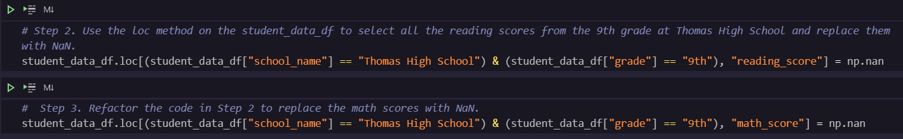
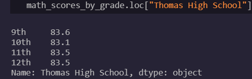
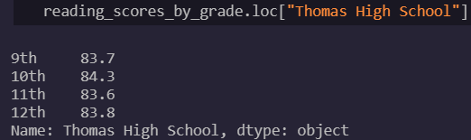
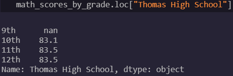
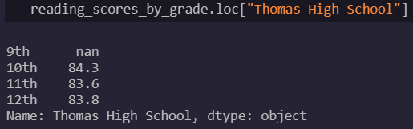
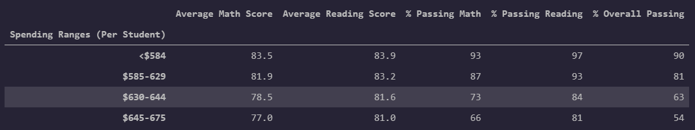
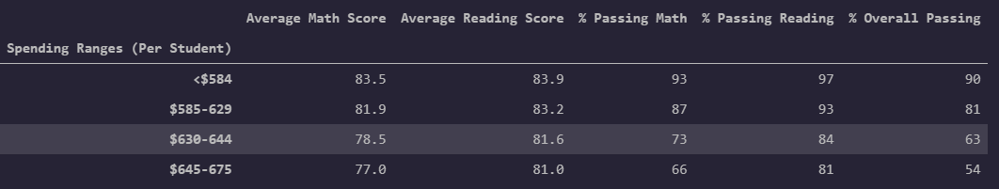
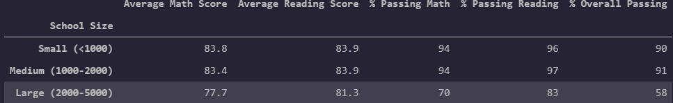
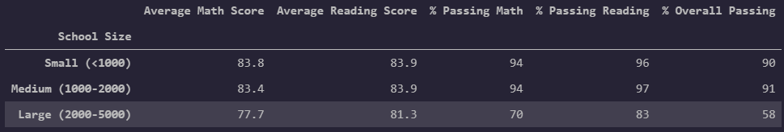
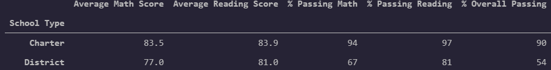

# School_District_Analysis

## Overview

The purpose of this analysis is to inspect grade performance data from various high schools in order to inform budgeting decisions.  We have data on each school's budget, school type, and size so that we may link these metrics to grade performance.  Our contractor, however, has informed us that the district suspects grades have been falsified for the ninth grade students at one of the high schools; therefore, we perform the data analysis on both the original data and the data once we have scrubbed the possibly false grades from Thomas High School's ninth grade class.

## Results

### NaN Replacement and Analysis

The following code was used to replace Thomas High School's 9th grade reading and math data with NaN

- District Summary Before and After Comparison

The following dataframe is the district summary before the Thomas High School 9th grade class grades are removed.

The next dataframe is the district summary after the Thomas High School 9th grade class grades are removed.

As we can see, all but one of the data points have gone down by a non-trivial amount.  The Thomas High School 9th grade class is 461 students.  They account for about 1% of the total number of students in the district.  This means, on average, the grades entered for the 9th graders at Thomas High School were higher than the district averages.

- Thomas High School Summary Before and After

Next, we will look at the school summary before and after for Thomas High School.  The first image is the school data before the 9th grade class is removed.  The first image is the Thomas High School summary before the 9th grade class grades are scrubbed.

As we can wee, around 90% of the students are passing.  The next image is the summary after the data from the 9th grade students are scrubbed.

The difference is glaring.  By ignoring a fourth of the students (the ninth grade), the overall passing percentage fell from 91% to 65%.  This is somewhat of a red flag.

- Thomas High School Performance Relative to Other Schools

Now we will look at Thomas High School's performance relative to other schools before and after the data scrubbing.  Before, we can see that Thomas High School's overall passing percentage is among the best of all the schools.

After we remove the 9th grade scores, we can see that Thomas High School's overall passing percentage is nowhere near the top.

Again, simply removing one grade level from the Thomas High School data was enough to move the school from the top tail to the bottom tail of the grade distribution.

- Math and reading scores by grade

First, we can see Thomas High School's reading and math grades before we removed the 9th grade class data.

As we can see, the averages for the 9th grade class seem to be on par with the other grades, so it would be easy to overlook the possibility of academic dishonesty if one only views this metric.  After, we can see the new dataframes are produced without Thomas High School's 9th grade averages.

- Scores by school spending

If we look at the average scores and overall passing percentages by school budget per student, we can see the table is unaltered when we exclude the 9th grade class from Thomas High School.  The first image is before the scrubbing, the second image is after.

If you refer back to the first images in this README, you will remember that Thomas High School's overall passing percentage was over 90 percent before the data scrubbing and around 65 percent afterwards.  If you look at the passing percentages by spending, you will find that Thomas High School's overall passing percentage is more in line with the <$584 bin, which wouldn't fit the data knowing Thomas High School's spending per student is $638.  Thomas High School's overall passing percentage is much more in line with the third bin once the data has been scrubbed.

- Scores by school size

Now we look at the scores by school size.  Thomas High School has 1635 students.  If you look at the two data frames, you will see the overall passing percentages are unaltered by the data scrubbing.  The first image is the data before scrubbing, the second is after.  Before the data scrubbing, Thomas High School's overall passing percentage (~90%) is most in line with the small bin, which does not math Thomas High School's population.  After the data scrubbing, the overall passing percentage doesn't improve the metric much.  Thomas High School's new passing percentage is roughly 65%, which is closer to the large bin.  This is a marginal improvement considering Thomas High School's population is closer to the large bin that it is to the small bin.

- Scores by school type

Below you will see the scores based on the type of school.  Thomas High School is a charter school, so we would expect their overall passing percentage to be around 90 percent, which is where it was before the 9th grade class data was removed.  After the 9th grade data is removed, Thomas High School's performance is much closer to the district schools' performance.

## Summary

Thomas High School's (THS) ninth grade class data was heavily influencing the school's performance related to other schools.  Before the 9th grade class is removed, THS's overall passing percentage is around 90 percent, but after the 9th grade class data is removed, the overall passing percentg drops to around 65%.  This leap up in the overall passing percentage has the effect of raising the entire district's overall passing percentage by a tenth of a percent.  It also places THS's performance among the best passing percentages across all fifteen schools.  Furthermore, this jump in passing percentage makes it look like THS's performance is more in line with bins it doesn't belong to in both the performance by school size and performance by budget categories.  Lastly, before the 9th grade class is removed, THS's performance is in line with the other charter schools, but after the 9th grade class is removed, THS performs much more like the district schools rather than the other charter schools.