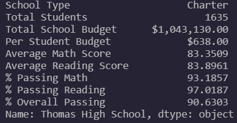
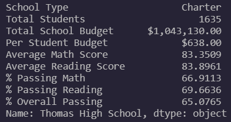
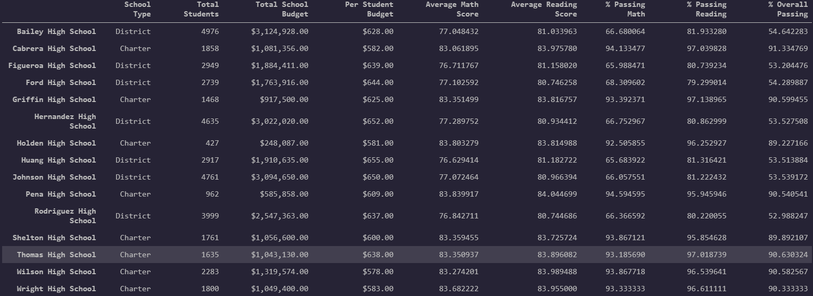
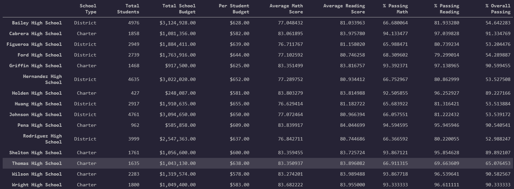

# School_District_Analysis

## Overview

The purpose of this analysis is to inspect grade performance data from various high schools in order to inform budgeting decisions.  We have data on each school's budget, school type, and size so that we may link these metrics to grade performance.  Our contractor, however, has informed us that the district suspects grades have been falsified for the ninth grade students at one of the high schools; therefore, we perform the data analysis on both the original data and the data once we have scrubbed the possibly false grades from Thomas High School's ninth grade class.

## Results
- District Summary Before and After Comparison

The following dataframe is the district summary before the Thomas High School 9th grade class grades are removed.

The next dataframe is the district summary after the Thomas High School 9th grade class grades are removed.

As we can see, all but one of the data points have gone down by a non-trivial amount.  The Thomas High School 9th grade class is 461 students.  They account for about 1% of the total number of students in the district.  This means, on average, the grades entered for the 9th graders at Thomas High School were higher than the district averages.

- Thomas High School Summary Before and After

Next, we will look at the school summary before and after for Thomas High School.  The first image is the school data before the 9th grade class is removed.  The first image is the Thomas High School summary before the 9th grade class grades are scrubbed.

As we can wee, around 90% of the students are passing.  The next image is the summary after the data from the 9th grade students are scrubbed.

The difference is glaring.  By ignoring a fourth of the students (the ninth grade), the overall passing percentage fell from 91% to 65%.  This is somewhat of a red flag.

- Thomas High School Performance Relative to Other Schools

Now we will look at Thomas High School's performance relative to other schools before and after the data scrubbing.  Before, we can see that Thomas High School's overall passing percentage is among the best of all the schools.

After we remove the 9th grade scores, we can see that Thomas High School's overall passing percentage is among the worst.

Again, simply removing one grade level from the Thomas High School data was enough to move the school from the top tail to the bottom tail of the grade distribution.

- Scores by school spending

## Summary